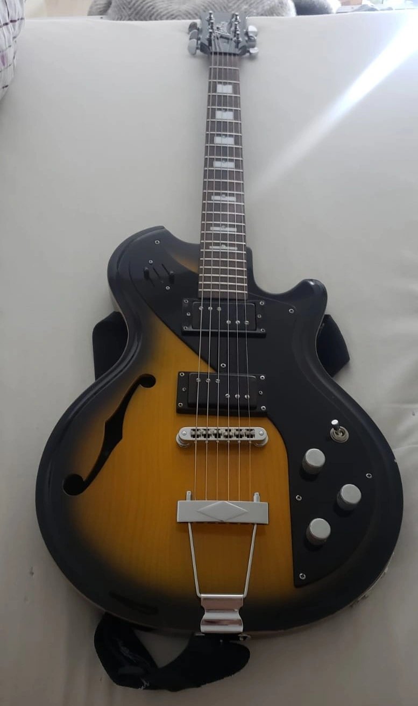

+++
title = "Home"
+++





Programmer and Environmentalist.

# Tools

- **Rust:** ORT, Axum, Tokio, Rayon, Ndarray, Egui, Images
- **Python:** PyTorch, TensorFlow, Scikit-learn, Hugging Face Transformers, Pydantic, RAG, Structured Output, FastAPI, Uvicorn, NumPy, Pandas, Polars, OpenCV, SQLAlchemy  
- **Julia:** Type safety, Arrays, Tidier
- **R:** Tidyverse
- **Dart:** Flutter  
- **C / C++:** ONNX, OpenCV, Open3D
- **SQL:** PostgreSQL, MySQL, SQLite, Pgvector, Supabase
- **JavaScript:** Vanilla JS, Bootstrap, HTML, CSS  

# My guitar

Italia Mondial Deluxe, modified



