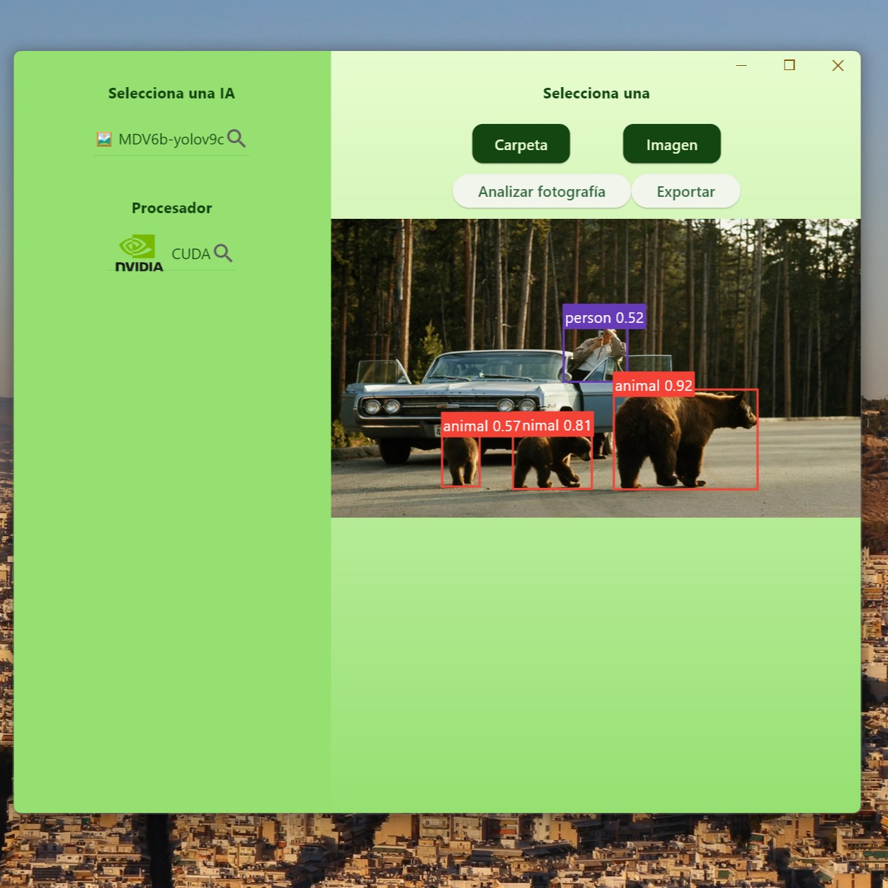

+++
authors = ["José Díaz"]
title = "Why I Switched from Flutter + Rust to Rust + egui"
description = "Random thoughts and lesons"
date = 2025-06-24
[taxonomies]
tags = ["Flutter", "Rust", "AI"]
[extra]
toc = true
toc_inline = true
toc_ordered = true
+++

This is just a personal experience, there are no absolute truths. Like in any other blog post, a lot of the things you'll read here could be just a skill issue, or legitimate issues. It's up to you to decide.

# Flutter + Rust

We had an app that had a nice Flutter UI that called Rust binaries. The bindings were generated using [flutter\_rust\_bridge](https://github.com/fzyzcjy/flutter_rust_bridge), which is an amazing piece of software. A lot of people have built large and complex apps using this tool. It's crazy how far it can just work, just by running:

```
flutter_rust_bridge_codegen generate
```

That's really all it takes for many, many, many cases. 

But I got frustrated for the few times that 'generate' won't work, for the times where FFI wasn't just working, and for the times that I had to spend energy designing a public API that was 100% friendly for Rust <-> Flutter.

# Rust + egui

After some time of being frustrated with the current stack, I was thinking of dropping Flutter, I didn't want to think about FFI anymore. I chose [egui](https://github.com/emilk/egui) to check if it was feasible to move the UI code with very little friction. I came to know about egui because of the extremely impressive work they've done to build [rerun](https://github.com/rerun-io/rerun). I was very motivated to try this.

After rewriting most of the UI code in egui during a weekend, I decided to move and leave Flutter behind. But why?

# Minimizing complexity

Having 2 programming languages adds complexity. BoquilaHUB is a small software project, I don't want it to have unnecessary complexity.

Not all complexity is unnecessary, you do sometimes need it in order to make progress and get things done. So, how much complexity is unnecessary complexity?

We can measure this by looking at lines of code. In my case, 'flutter_rust_bridge_codegen generate' will generate a few thousand lines of code. I don't understand this generated code, it's not readable. Do I really want to have some code I don't understand in my project folder? In earlier versions of the project, sometimes the amount of generated lines would be higher than the lines written by me. This balance would change depending on the API, but it's always quite big.

I want to understand my project, I want to understand what I'm compiling. I can't optimize generated lines that aren't readable and will change in mysterious ways when I change the API.

# Playing to my strengths

There is only 1 programmer in the project, and that's me. I was hoping to get funding to get an actually good GUI person who could make great use of Flutter to create a wonderful GUI experience. That didn't happen, so the Flutter capabilities were very underused.

Flutter:



Egui:


Of course, making the Flutter one look good is possible and easy if you're good at it. I wasn't, and egui just worked better for me. I didn't even make an effort to make it look good; I just grabbed a minimal template and modified it, and it looks great.

# Immediate mode is a great paradigm for UI

A quick Google search with "flutter setstate is not refreshing" reveals a struggle that you will face quite often when running Flutter. It sounds like an easy fix, but the nature of Flutter using a bunch of nested Widgets creates, naturally, lasagna code that makes it hard to reason about this.

When moving to egui, I recreated the whole UI with 0 cases of this problem. It's a different paradigm, in every frame the UI will refresh, so you don't have to struggle. You don't have to make complex callbacks or deal with state management frameworks like getx, provider, bloc, or whatever else there is. If you work with the paradigm and not against it, you're done, you can make great progress. 

Do you need to add a button? In Rust:

```rust
if ui.button("click me").clicked() {
    self.did_user_click = true; // trigger a bunch of logic elsewhere, if you want!
    // also do whatever you want
}
```

That's it, you will 100% see the change in your UI, no callbacks, no stateful vs stateless widgets, no googling why your UI is not refreshing. No learning a new metaframework (getx, bloc, provider, etc) for a framework (flutter) to deal with state. It just works in egui.

# Performance

This is not about Rust being fast and Dart being slow. It's about my personal appreciation that the final app in 100% Rust was faster. 

The previous slowness maybe was a side effect of having unmonitored FFI, how much was I cloning? I don't know. The app calls ONNX Runtime, which is written in C. This is called from Rust using [ort](https://github.com/pykeio/ort), and before, Dart would call these binaries to let me do the inference in Flutter. Maybe all of this made the app drag a bit.

Now it just feels faster and way more snappy.

# Anyway

That's it. If you fancy AI for biodiversity, feel free to support [BoquilaHUB](https://github.com/boquila/boquilahub/) at this [link](https://boquila.org/donate).