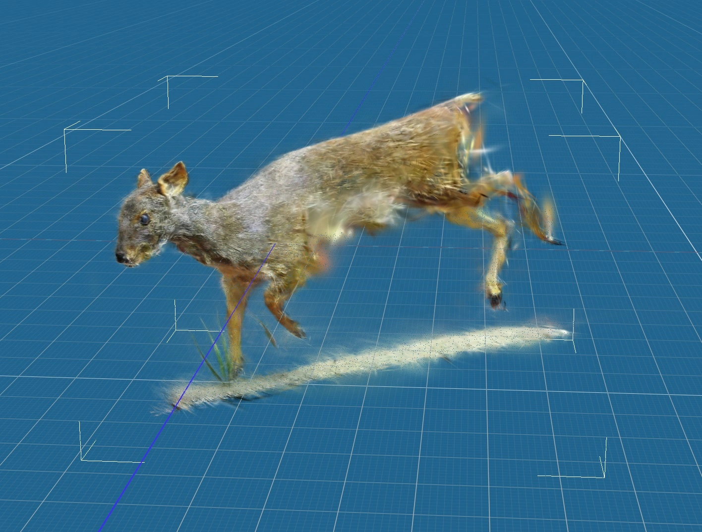

+++
title = "Projects"
+++

# BoquilaHUB





The best AI tool to monitor nature

[github.com/boquila/boquilahub](https://github.com/boquila/boquilahub/)

# BoquilaVerse





A collection of 3D models created using Gaussian Splatting, and then used for synthetic dataset creation.

Still in development

[boquila.org/verse](https://boquila.org/verse)

# Ocrisp





One-click RAG implementation, Simple and Portable.

[github.com/boquila/ocrisp](https://github.com/boquila/ocrisp/)

# TidierVest

Web scraping in Julia, based on rvest. (Faster than Beautiful Soup or Rvest)

```julia
using TidierVest

starwars = read_html("https://rvest.tidyverse.org/articles/starwars.html")

titles = html_elements(starwars, ["section", "h2"]) |> html_text3
titles
# 7-element Vector{String}:
#  "The Phantom Menace"
#  "Attack of the Clones"
#  "Revenge of the Sith"
#  ⋮
#  "Return of the Jedi"
#  "The Force Awakens"
```

# pdfx

Minimal AI-retrival info on PDFs. Returns JSON.


<video src="pdfx.mp4" muted="" loop="" autoplay=""></video>


[github.com/jdiaz97/pdfx](https://github.com/jdiaz97/pdfx)

# TBA

Code quality assurance tool. For Rust and written in Rust.