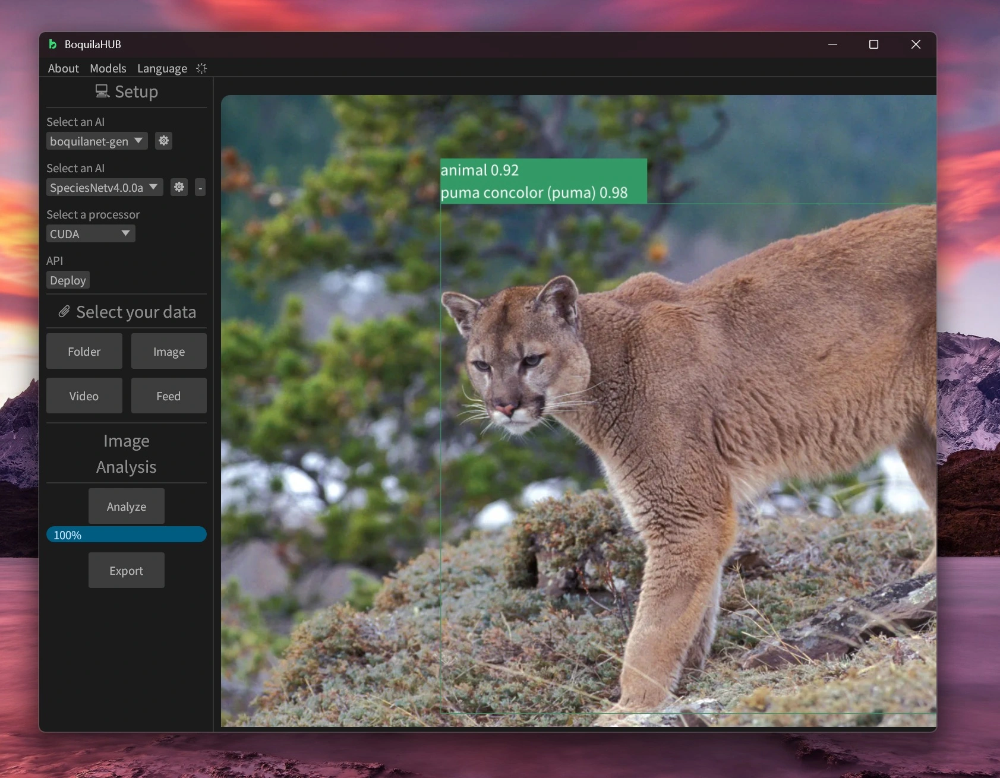
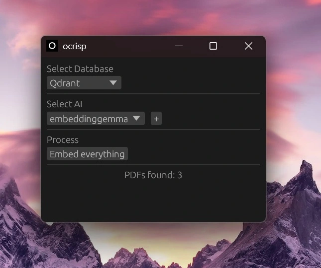

+++
title = "Projects"
+++

# BoquilaHUB





The best AI tool to monitor nature

[github.com/boquila/boquilahub](https://github.com/boquila/boquilahub/)

# BoquilaVerse





A collection of 3D models created for synthetic dataset creation.

[boquila.org/verse](https://boquila.org/verse)

# Ocrisp





One-click RAG implementation, Simple and Portable.

[github.com/boquila/ocrisp](https://github.com/boquila/ocrisp/)

# TBA

Code quality assurance tool. For Rust and written in Rust.